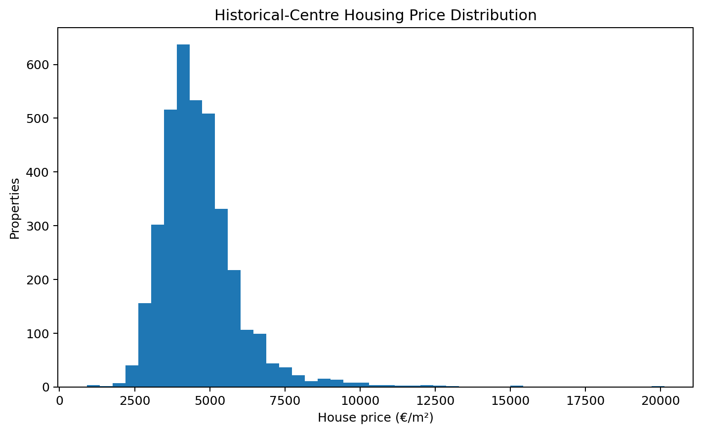
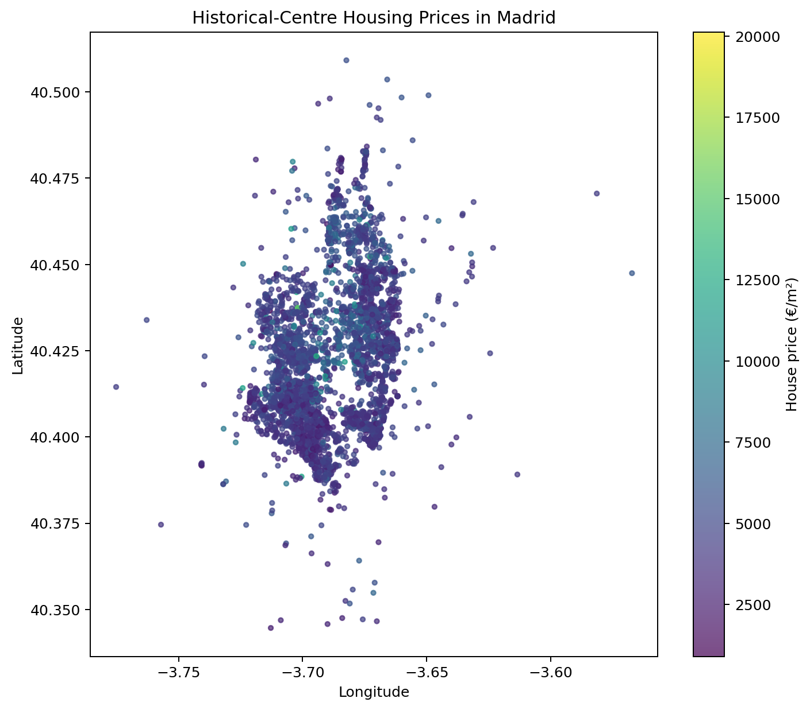
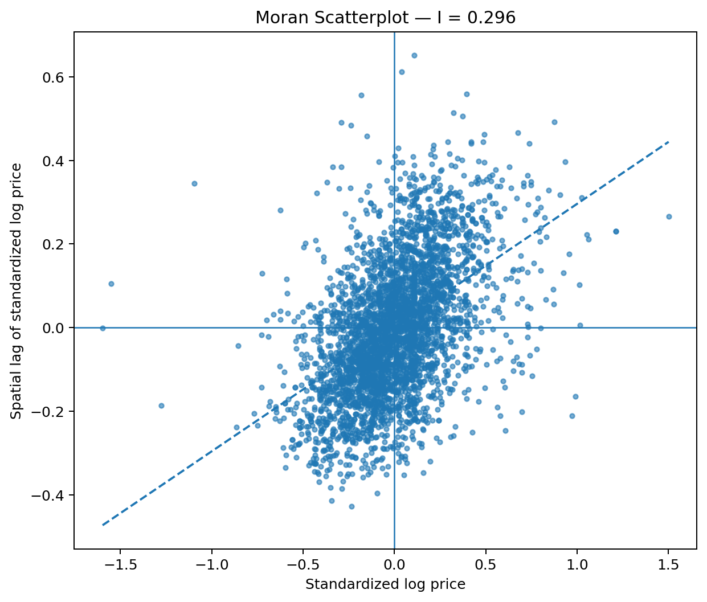
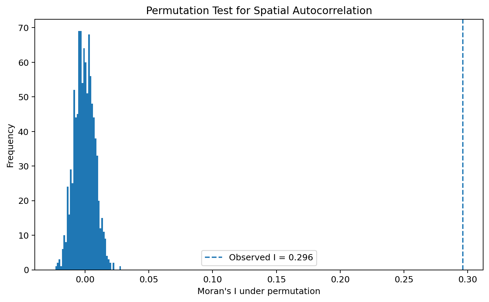
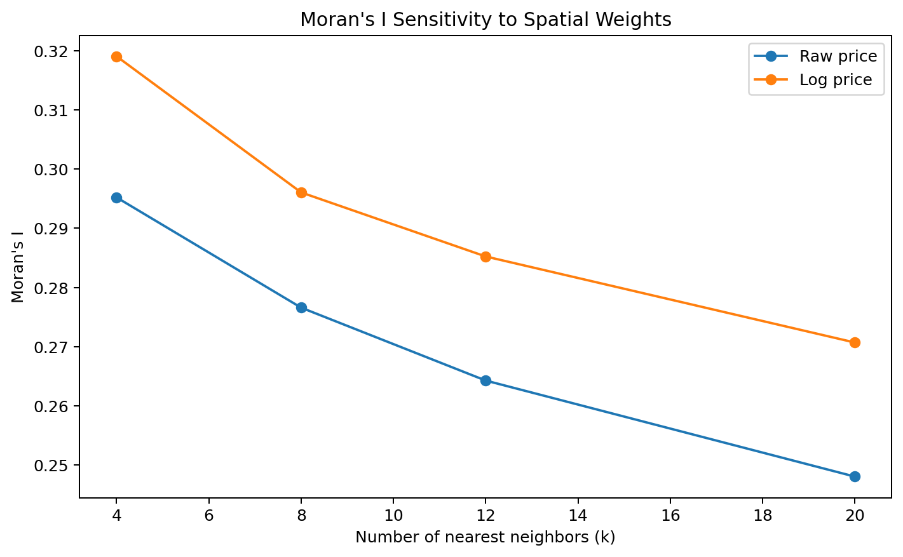
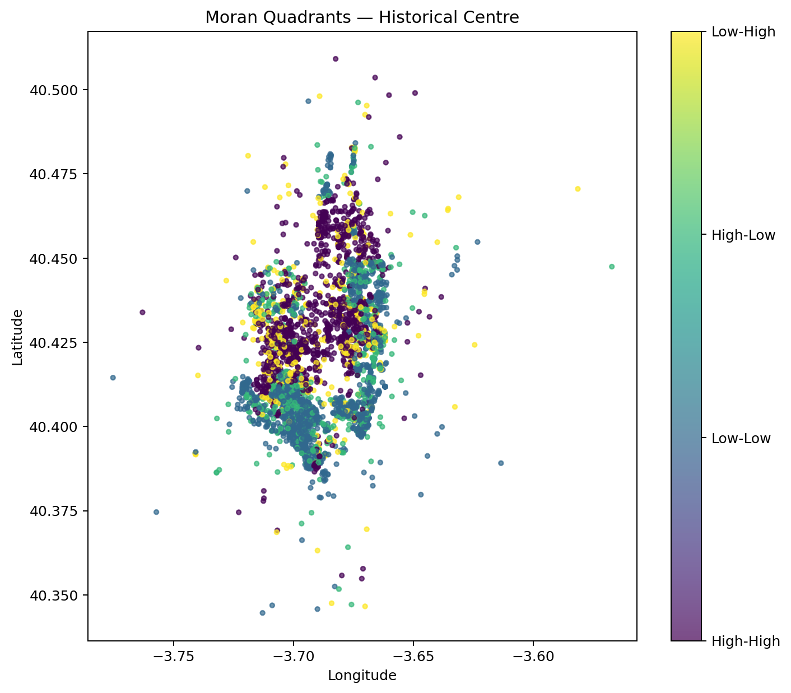

# Madrid Housing Spatial Autocorrelation

### Spatial-statistics analysis of housing prices in Madrid's historical centre

This project measures whether geographically nearby homes in Madrid's historical centre tend to have similar prices per square metre.

It reconstructs the spatial-statistics component of an academic predictive-modeling exercise as a standalone portfolio project using **k-nearest-neighbor spatial weights, global Moran's I and permutation testing**.

---

## Project Highlights

- **10,512** observations in the full Madrid housing dataset
- **3,633** historical-centre properties analyzed
- Georeferenced longitude / latitude data
- Haversine nearest-neighbor distances
- Row-standardized k-nearest-neighbor spatial weights
- Global Moran's I
- 999-permutation significance test
- Raw-price and log-price comparison
- Robustness across `k = 4, 8, 12, 20`
- Moran scatterplot
- Exploratory High-High / Low-Low spatial quadrants

---

## Main Result

Using **8-nearest-neighbor** spatial weights:

| Metric | Raw Price | Log Price |
|---|---:|---:|
| Moran's I | **0.2766** | **0.2961** |
| Permutation p-value | **0.001** | **0.001** |

The result is **positive and statistically significant**.

This means nearby properties tend to have more similar prices than would be expected if housing prices were spatially random.

---

## Historical-Centre Sample

The academic task asks specifically for properties with:

```text
historical = 1
```

After validating price and coordinates, the analysis contains:

**3,633 properties**

Median price:

**€4,444/m²**



---

## Geographic Pattern



The visual pattern suggests that expensive and inexpensive observations are not distributed independently across space.

Global Moran's I formalizes this pattern.

---

## Spatial Weights

The main spatial neighborhood is based on the **8 geographically nearest properties**.

Distances are computed from latitude and longitude using the **haversine metric**.

Average 8-neighbor distance:

**0.131 km**

Each neighbor receives equal row-standardized weight.

---

## Moran's I

Moran's I compares each observation with the average standardized value of its spatial neighbors.

- `I > 0` → similar values cluster geographically
- `I ≈ 0` → spatial randomness
- `I < 0` → neighboring observations tend to be dissimilar

For log housing prices:

**I = 0.2961**



---

## Permutation Test

The project randomly permutes prices **999 times** while preserving the spatial-neighbor structure.



Observed log-price Moran's I:

**0.2961**

Permutation p-value:

**0.001**

The observed autocorrelation is far larger than values generated under spatial randomness.

---

## Robustness to Spatial Weights

A spatial-statistics conclusion can depend on how a “neighbor” is defined.

For that reason, the project repeats the calculation with:

- 4 nearest neighbors
- 8 nearest neighbors
- 12 nearest neighbors
- 20 nearest neighbors



Across all specifications:

- Raw-price Moran's I: **0.248–0.295**
- Log-price Moran's I: **0.271–0.319**

The conclusion remains positive throughout.

---

## Exploratory Moran Quadrants



The standardized log-price / spatial-lag quadrants contain:

- **Low-Low**: 1,318
- **High-High**: 1,177
- **High-Low**: 610
- **Low-High**: 528

These are exploratory quadrants rather than significance-filtered Local Moran clusters.

---

## Academic Context

The coursework describes the data as drawn from:

Montero, Mínguez & Fernández-Avilés (2018),  
*Housing price prediction: parametric vs semiparametric spatial hedonic models*,  
**Journal of Geographical Systems**, 20, 27–55.

DOI: `10.1007/s10109-017-0257-y`

See [`docs/academic_context.md`](docs/academic_context.md).

---

## Repository Structure

```text
madrid-housing-spatial-autocorrelation/
├── data/
│   └── README.md
├── docs/
│   ├── academic_context.md
│   └── methodology.md
├── images/
│   ├── historical_price_map.png
│   ├── moran_permutation.png
│   ├── moran_quadrants_map.png
│   ├── moran_scatterplot.png
│   ├── moran_sensitivity.png
│   └── price_distribution.png
├── notebooks/
│   └── madrid_housing_spatial_autocorrelation.ipynb
├── results/
│   ├── README.md
│   ├── moran_quadrant_counts.csv
│   ├── moran_sensitivity.csv
│   └── spatial_summary.csv
├── src/
│   ├── __init__.py
│   └── spatial_stats.py
├── .gitignore
├── README.md
└── requirements.txt
```

---

## Reproducibility

Install:

```bash
pip install -r requirements.txt
```

Place the original file at:

```text
data/Data_Housing_Madrid.csv
```

Then run:

```text
notebooks/madrid_housing_spatial_autocorrelation.ipynb
```

The raw coursework dataset is excluded from the public repository, while the notebook is saved with its analytical outputs.

---

## Skills Demonstrated

**Python · Spatial Statistics · Moran's I · Geospatial Analytics · K-Nearest Neighbors · Haversine Distance · Permutation Testing · Housing Analytics · Spatial Weights · Data Visualization**

---

## Author

**Anastasia García Reziapova**

Spatial Data Science Portfolio Project
